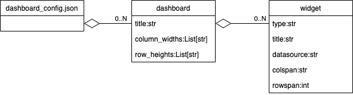
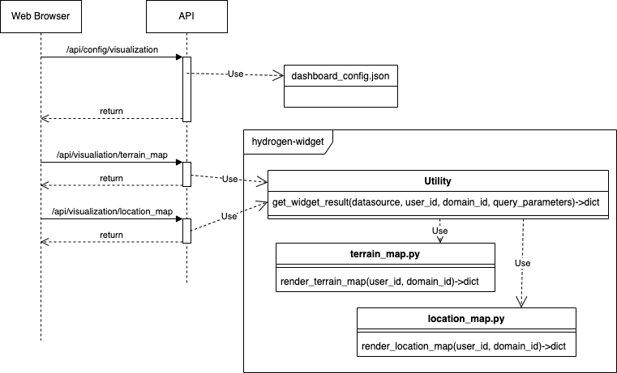
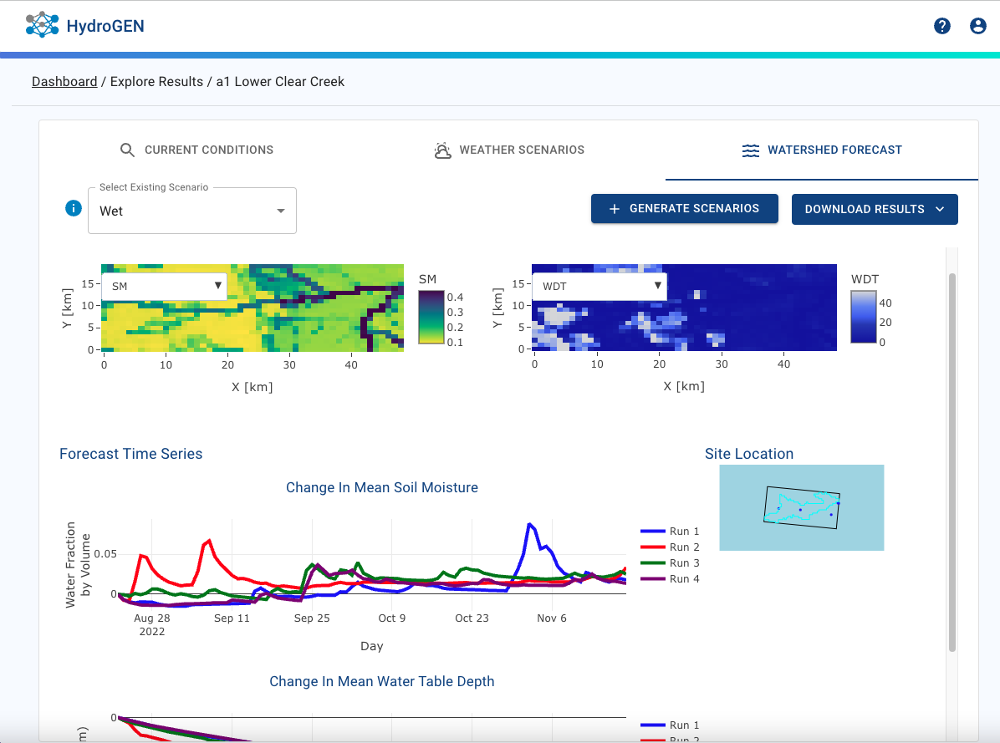

# Hydrogen-Widgets

This repo contains source code for hydrogen application visualization widgets.

Each widget is a single python file with a method that returns a JSON object containing the arguments to render the widget using plotly js.

# Repo Directory Structure

The repo contains a setup.py and setup.cfg so this repo can be installed as a PIP component.

The source code is organized as:

|Folder|Purpose|
|------|-------|
|hydrogen\_widgets|Source directory for widgets|
|hydrogen\_widgets/utilities|Utility modules used by widgets and utilities to access widgets.|
|tests|Unit tests for widgets|

# How to Develop and Test A Widget

Widgets can be developed by cloning this repo to a laptop and creating
a new .py file in the hydrogen\_widgets folder. A widget must contain a function that accept 3 arguments:

  * user\_id
  * domain\_id
  * query\_parameters

The query\_parameters can be used to access additional arguments such as scenario_id passed from the UI.

The function can get the absolute domain path containing the files to be visualized using a method from the hydrogen\_common shared components.

    domain_path = hydrogen_common.get_domain_path(user_id, domain_id)

The function must return a dict containing attributes:

|Attribute|Purpose|
|---------|-------|
|traces|Array of traces used as the data argument to the plotly js call.|
|layout|Dictionary of information used as the layout argument to the plotly js call.|
|aspectRatio|A number between 0-1 specifying the aspect ratio to be used in the layout. This is optional.|

If you add a main routine to the component like one of the examples you can test the widget locally. For example,

    cd hydrogen_widgets
    python current_conditions_heatmap.py

This will run the widget locally and create an HTML file with the same name as the widget that can be viewed with a local web browser. This uses a small example domain directory locally from this repo.

# List of Widgets
The following are widgets currently contained in this repo.

|Widget|Purpose|
|------|-------|
|current\_conditions\_heatmap|Heatmap of soil moisture and water depth on current conditions dashboard.|
|forecast\_soilmoisture\_heatmap|HeatMap of soil moisture on forecast dashboard.|
|forecast\_timeseries|Time series line graph of soil moisture and water depth changes on forecast dashboard.|
|location\_map|Location map of selected domain.|
|scenarios\_timeseries|Time series of Forcing observations for a scenario.|
|streamflow\_points|Time series graph of observations values over time.|
|terrain\_map|Terrain map showing observation points.|
|terrian\_obs\_points|Time series of observations triggered from terrain map point.|

# Unit Tests
The tests folder contains python unit tests for each widget.

You can run all the unit tests by executing pytest from the root of the repository. You can run a single unit test using pytest or by just executing the a unit test file using python.

All unit tests must pass before accepting a pull request into the repo.

# Dashboard Widget Configuration

Widgets used in the UI are displayed in various dashboards. The supported dashboards are hard coded in the UI. However, the widgets displayed in each dashboard can be configured by a file
in this repo. You can edit the wigets displayed in each dashboard by changing the file:

    hydrogen_widgets/utilities/data/dashboard_config.json

The following dashboards are currently supported in dashboard_config.json

  * watershed_conditions
  * point_observations
  * scenarios
  * forecasts

Each dashboard contains a title and the column widths and row hights of the layout of the dashboard. A dashboard also contains a list of widgets and each widget is identified with a datasource to identify the data to be used to render the widget.

The dashboard configuration is retrieved by the javascript UI and when a dashboard needs to be rendered the Web browser calls the API for each widget passing the datasource which is used to execute the python widget code.

The return value from the API is json containing both the data and configure to allow the UI to render the widget with the plotly javascript library.

   
To add a new widget you must do the following:

   1. Create a new widget implementation .py file.
   2. Modify the get\_widget\_result.py file to add a call to the new widget.
   3. Edit dashboard\_config.json to add a widget to a dashboard using the data\_source defined in #2.

The widgets in the dashboard are then rendered in javascript in the React application as shown in the example below. Note the dashboard below shows 4 widgets all developed and rendered independently with widget row/column layout specified in the json file.

